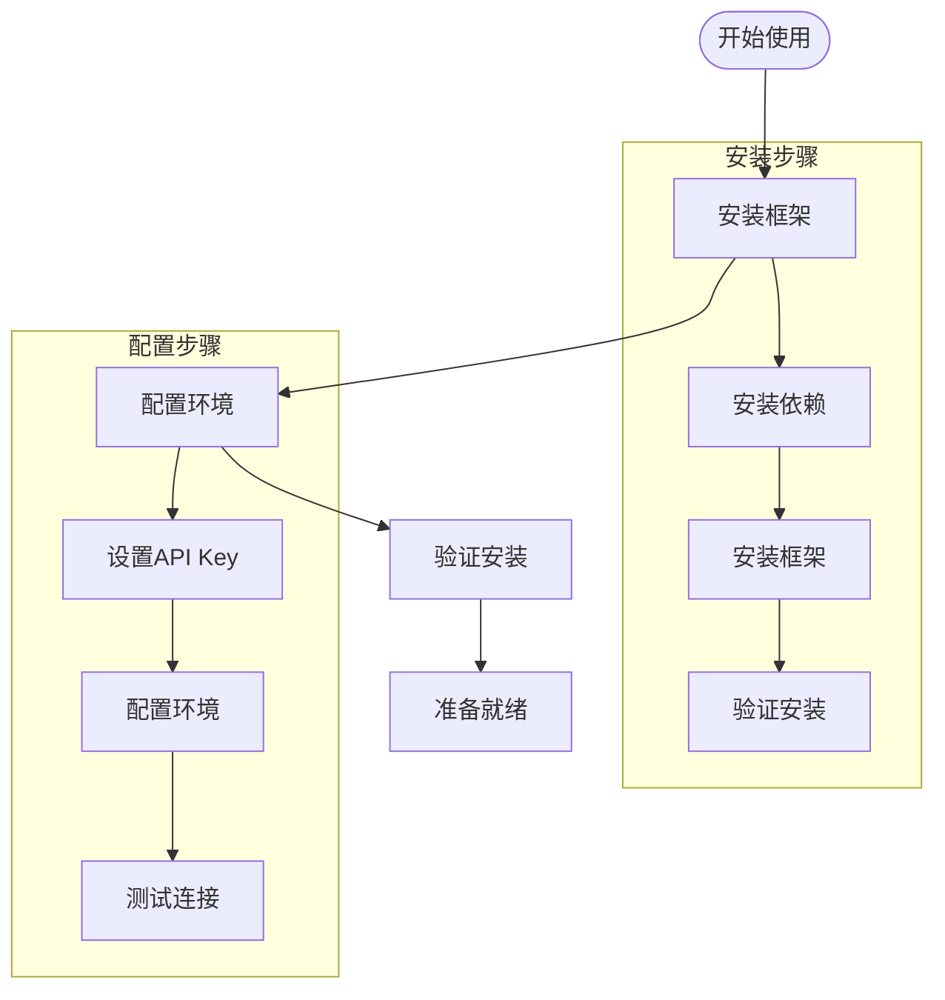
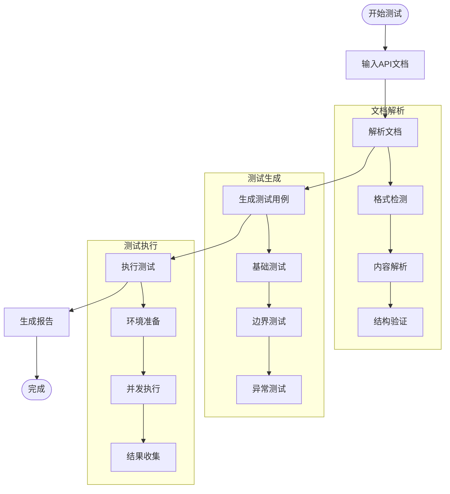
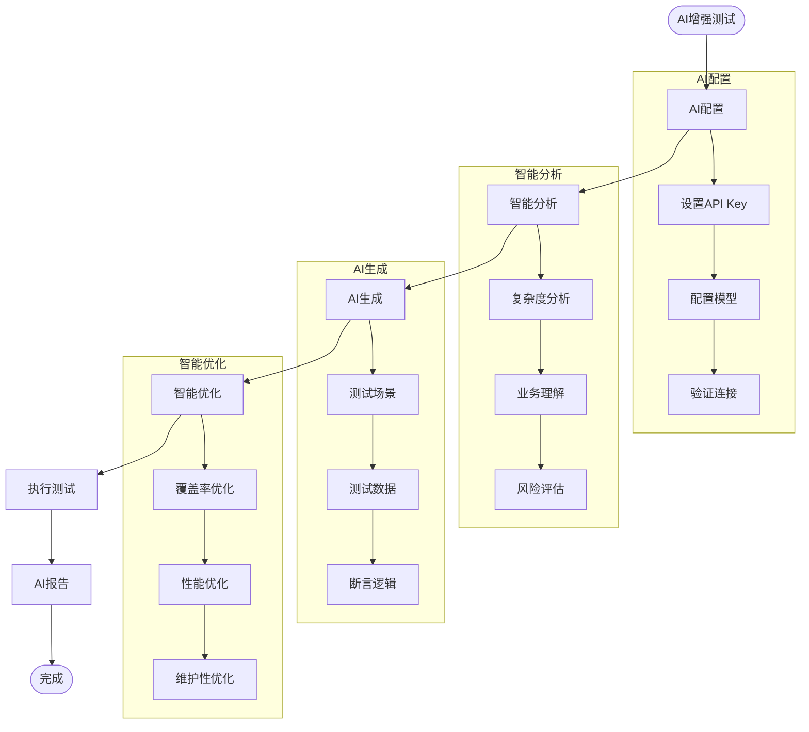
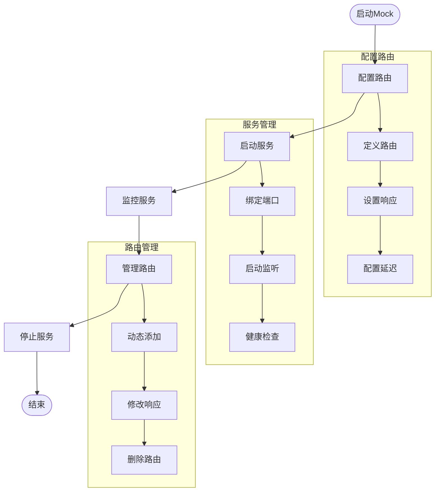
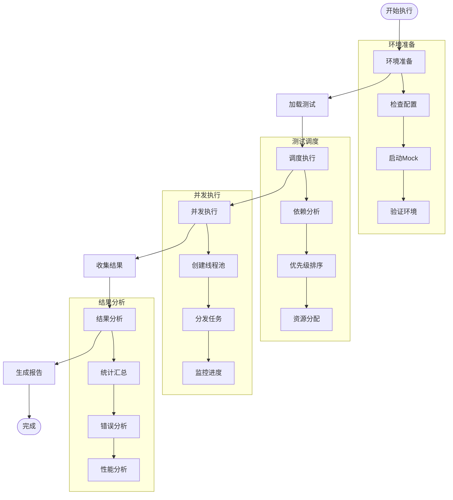
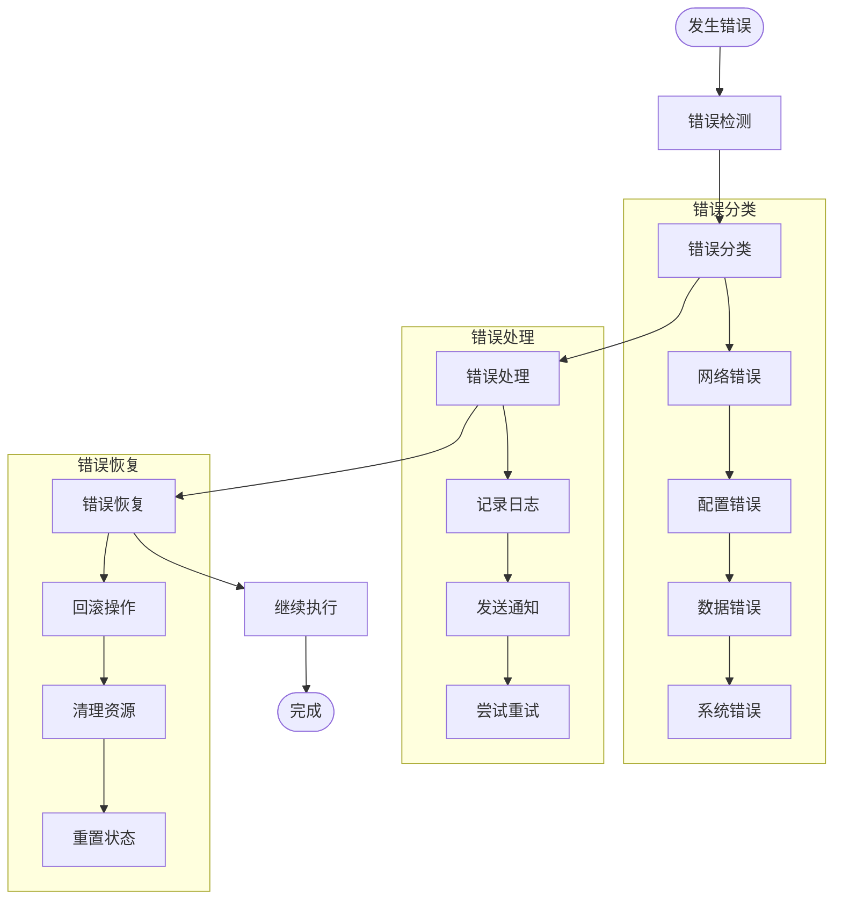
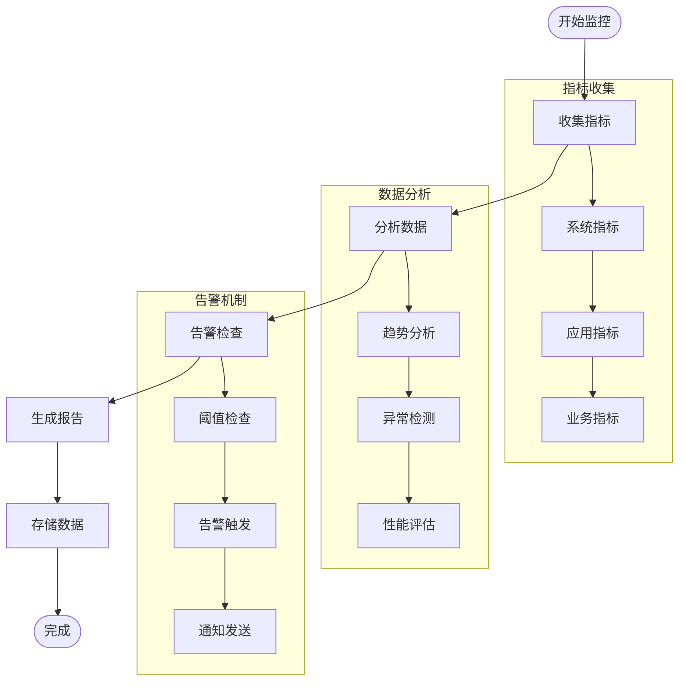
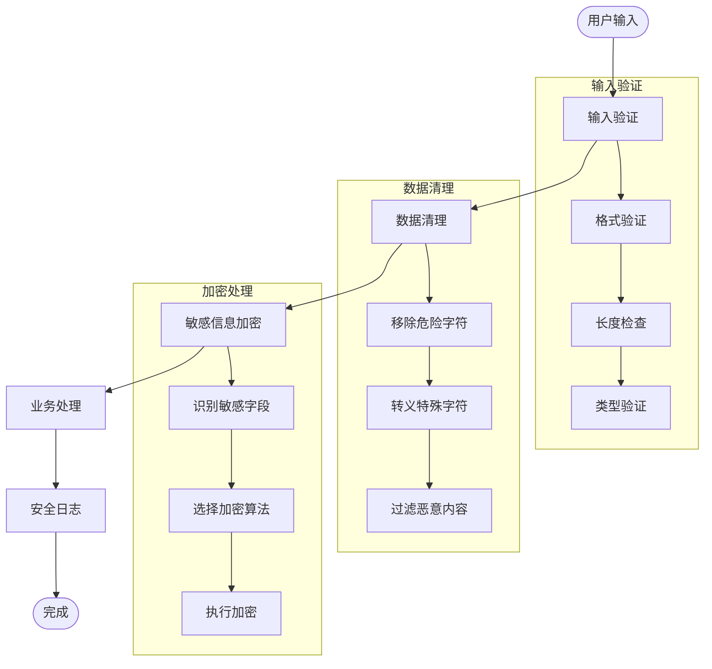
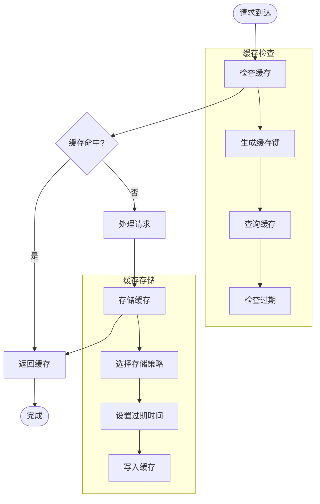
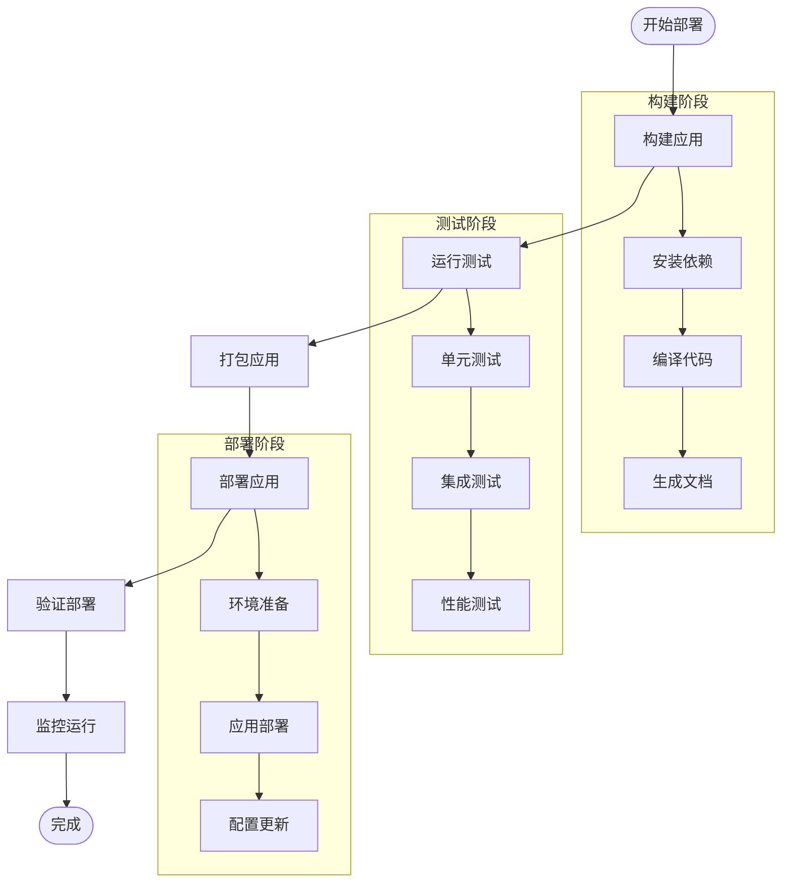

# 接口自动化测试框架 - 使用流程图

## 快速开始流程

## 基础测试流程

## AI增强测试流程

## Mock服务器流程

## 测试执行详细流程

## 错误处理流程

## 性能监控流程

## 安全防护流程

## 缓存管理流程

## 部署流程

## 使用场景示例

### 场景1：新项目快速开始
1. 安装框架 → 2. 配置AI → 3. 导入API文档 → 4. 一键生成测试 → 5. 执行测试 → 6. 查看报告

### 场景2：现有项目集成
1. 分析现有测试 → 2. 识别改进点 → 3. AI优化建议 → 4. 生成新测试 → 5. 对比效果 → 6. 持续改进

### 场景3：CI/CD集成
1. 配置流水线 → 2. 设置触发条件 → 3. 自动执行测试 → 4. 生成报告 → 5. 发送通知 → 6. 归档结果

### 场景4：性能测试
1. 配置性能参数 → 2. 生成负载测试 → 3. 执行并发测试 → 4. 监控系统资源 → 5. 分析性能瓶颈 → 6. 优化建议
