# 接口自动化测试框架 - 技术架构文档

## 目录
1. [架构概述](#架构概述)
2. [核心模块设计](#核心模块设计)
3. [AI智能化体系](#ai智能化体系)
4. [安全架构](#安全架构)
5. [性能优化架构](#性能优化架构)
6. [监控体系](#监控体系)
7. [扩展性设计](#扩展性设计)
8. [部署架构](#部署架构)

## 架构概述

### 整体架构原则
- **模块化设计**: 高内聚、低耦合的模块化架构
- **分层架构**: 清晰的分层结构，职责分离
- **可扩展性**: 支持插件化和配置驱动的扩展
- **高性能**: 异步处理、缓存优化、并发执行
- **安全性**: 多层安全防护，敏感信息保护
- **可观测性**: 全面的监控和日志体系

### 技术栈
- **语言**: Python 3.8+
- **框架**: Flask, Click, AsyncIO
- **AI集成**: DeepSeek API
- **数据存储**: SQLite, Redis, 文件系统
- **网络**: HTTP/HTTPS, WebSocket
- **安全**: Cryptography, 输入验证
- **监控**: 自定义性能监控, 系统监控

## 核心模块设计

### 1. CLI模块 (`src/cli/`)
```python
# 主要组件
- main.py: 主命令行入口
- advanced_generator.py: 高级生成器
- ai_*.py: AI相关命令
```

**设计特点**:
- 统一的命令结构
- 参数验证和错误处理
- 用户友好的交互界面
- 支持批量操作

### 2. AI模块 (`src/ai/`)
```python
# 四层智能化架构
L1: deepseek_client.py, ai_test_generator.py, ai_test_reporter.py
L2: ai_completion_manager.py
L3: ai_decision_center.py
L4: ai_chat_assistant.py
```

**设计特点**:
- 分层架构，职责清晰
- 统一的AI接口
- 智能决策和推荐
- 自然语言交互

### 3. 核心模块 (`src/core/`)
```python
# 核心功能
- base_test.py: 测试基类
- request_handler.py: 同步请求处理
- async_request_handler.py: 异步请求处理
- test_executor.py: 测试执行器
```

**设计特点**:
- 支持同步和异步处理
- 统一的测试接口
- 高性能请求处理
- 智能重试机制

### 4. 工具模块 (`src/utils/`)
```python
# 工具组件
- config_loader.py: 配置管理
- security_manager.py: 安全管理
- cache_manager.py: 缓存管理
- performance_monitor.py: 性能监控
- data_manager.py: 数据管理
```

**设计特点**:
- 统一的工具接口
- 安全的数据处理
- 高性能缓存
- 实时监控

## AI智能化体系

### L1: 基础AI功能层
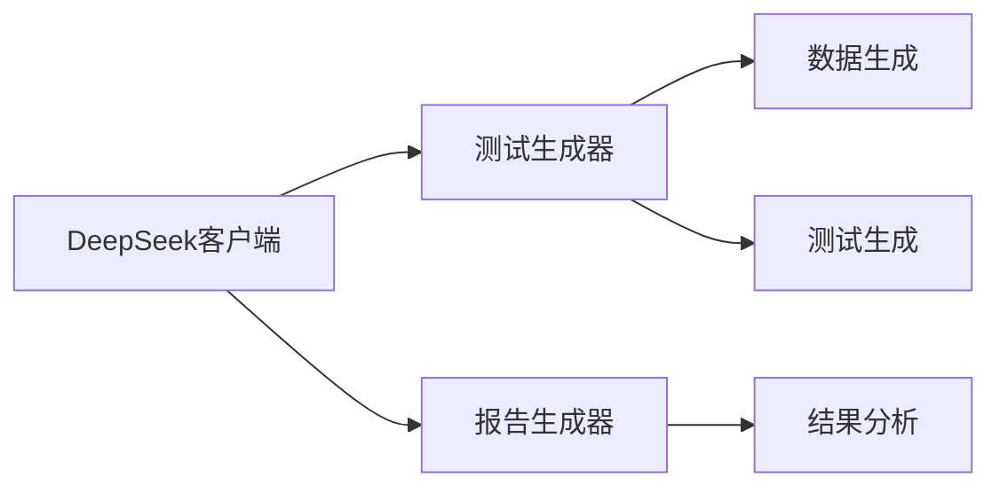

**核心组件**:
- **DeepSeekClient**: AI API客户端，提供基础AI交互能力
- **AITestGenerator**: 综合测试生成器，整合测试用例、数据生成、API分析功能
- **AITestReporter**: AI增强测试报告生成器，智能分析和洞察

### L2: 智能分析层
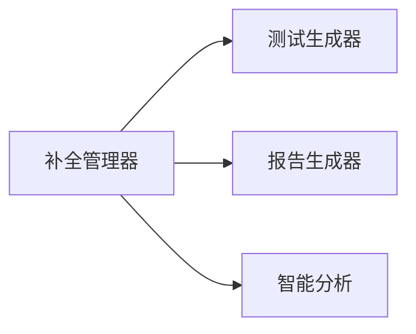

**核心组件**:
- **AICompletionManager**: AI补全管理器，统一协调所有AI补全任务

### L3: 智能决策层
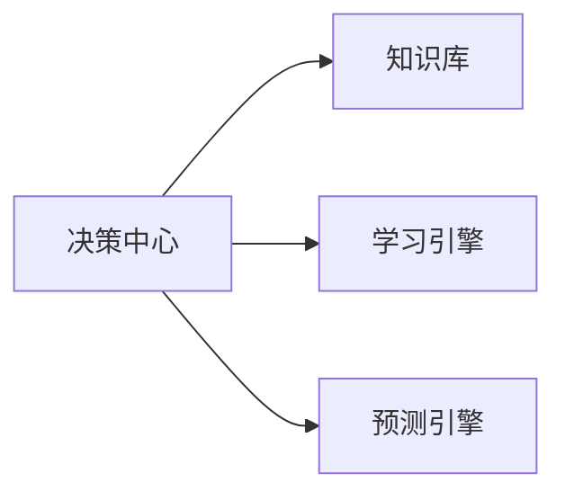

**核心组件**:
- **AIDecisionCenter**: AI决策中心，框架的智能大脑和决策支持

### L4: 智能交互层
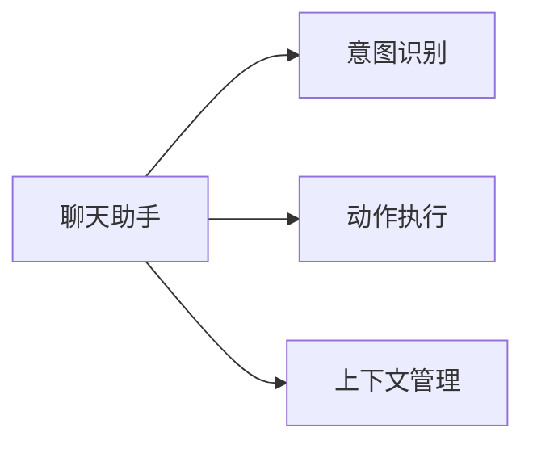

**核心组件**:
- **AIChatAssistant**: AI聊天助手，自然语言交互界面

## 安全架构

### 安全防护层次
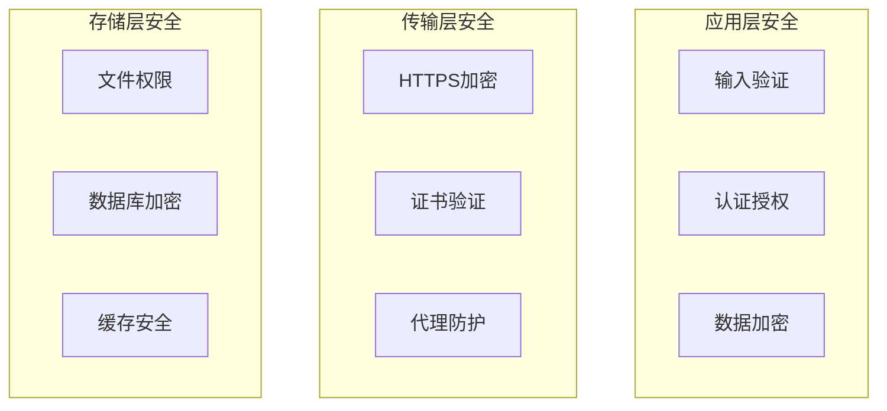

### 安全组件设计

#### 1. SecurityManager
```python
class SecurityManager:
    """安全管理器"""
    - encrypt_sensitive_data(): 敏感信息加密
    - decrypt_sensitive_data(): 敏感信息解密
    - validate_api_endpoint(): API端点验证
    - sanitize_input(): 输入数据清理
    - mask_sensitive_info(): 敏感信息遮蔽
```

#### 2. SecureConfigManager
```python
class SecureConfigManager:
    """安全配置管理器"""
    - load_secure_config(): 加载安全配置
    - save_secure_config(): 保存安全配置
    - _encrypt_sensitive_fields(): 加密敏感字段
    - _decrypt_sensitive_fields(): 解密敏感字段
```

### 安全策略
- **输入验证**: 严格的输入格式验证和长度限制
- **数据清理**: 移除危险字符和恶意内容
- **敏感信息保护**: 自动识别和加密敏感字段
- **访问控制**: 基于角色的访问控制
- **审计日志**: 完整的操作审计日志

## 性能优化架构

### 异步处理架构
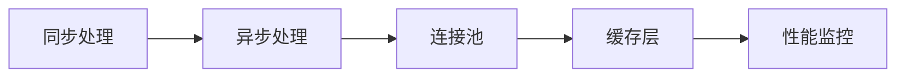

### 缓存架构
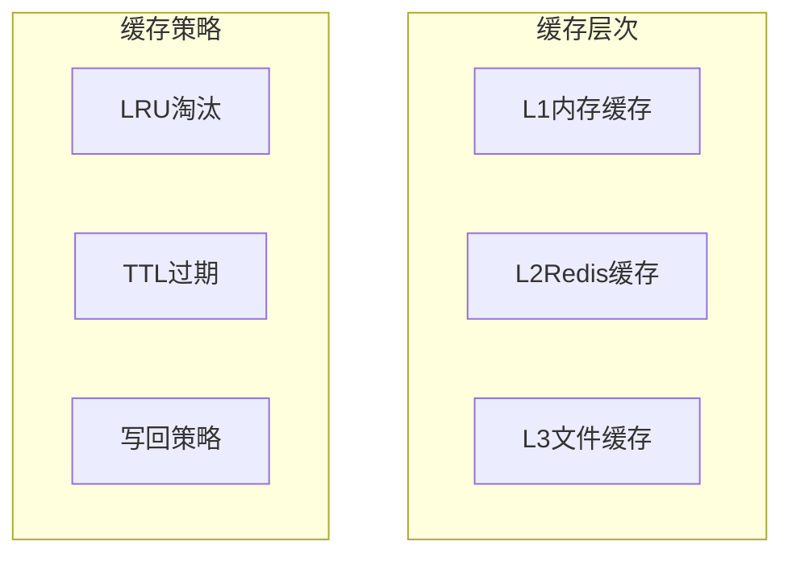

### 性能优化组件

#### 1. AsyncRequestHandler
```python
class AsyncRequestHandler:
    """异步请求处理器"""
    - request(): 异步HTTP请求
    - batch_request(): 批量异步请求
    - health_check(): 健康检查
    - get_connection_info(): 连接信息
```

#### 2. CacheManager
```python
class CacheManager:
    """缓存管理器"""
    - MemoryCache: 内存缓存实现
    - RedisCache: Redis缓存实现
    - cached(): 缓存装饰器
```

### 性能优化策略
- **异步处理**: 使用AsyncIO提高并发性能
- **连接池**: HTTP连接复用，减少连接开销
- **智能缓存**: 多级缓存，提高数据访问速度
- **批量处理**: 批量操作减少网络开销
- **资源监控**: 实时监控系统资源使用

## 监控体系

### 监控架构
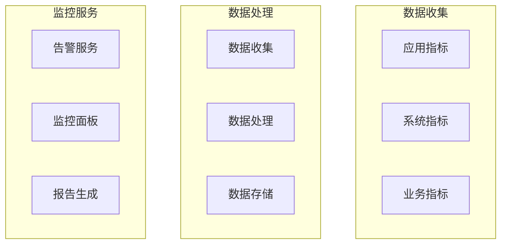

### 监控组件

#### 1. PerformanceMonitor
```python
class PerformanceMonitor:
    """性能监控器"""
    - monitor_function(): 函数性能监控装饰器
    - start_system_monitoring(): 启动系统监控
    - get_performance_summary(): 获取性能摘要
    - export_metrics(): 导出性能指标
```

### 监控指标
- **性能指标**: 执行时间、内存使用、CPU使用率
- **系统指标**: 系统资源使用、网络状态、磁盘空间
- **业务指标**: 测试成功率、错误率、覆盖率
- **安全指标**: 安全事件、访问日志、异常行为

## 扩展性设计

### 插件化架构
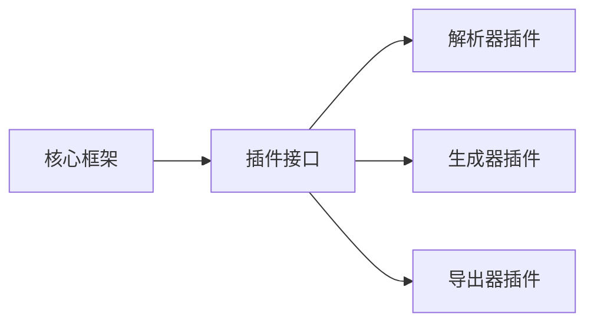

### 配置驱动
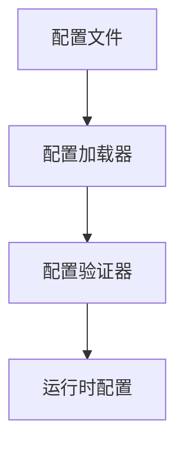

### 扩展点设计
- **解析器扩展**: 支持新的API文档格式
- **生成器扩展**: 支持新的测试代码生成
- **导出器扩展**: 支持新的报告格式
- **认证扩展**: 支持新的认证方式
- **监控扩展**: 支持新的监控指标

## 部署架构

### 部署模式
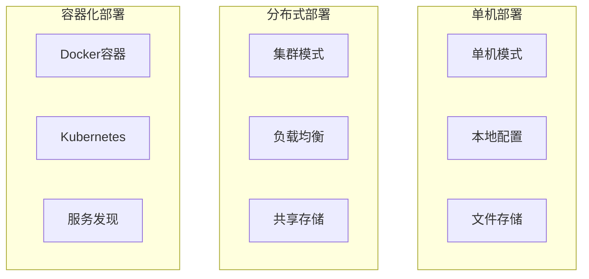

### 环境配置
```yaml
# 开发环境
development:
  debug: true
  log_level: DEBUG
  mock_enabled: true
  
# 测试环境
testing:
  debug: false
  log_level: INFO
  mock_enabled: true
  
# 生产环境
production:
  debug: false
  log_level: WARNING
  mock_enabled: false
  security_enhanced: true
```

### 部署策略
- **蓝绿部署**: 零停机部署
- **滚动更新**: 渐进式更新
- **金丝雀发布**: 小流量验证
- **回滚机制**: 快速回滚能力

## 总结

本框架采用现代化的软件架构设计，具有以下特点：

### 优势
1. **智能化**: 四层AI架构，提供智能化的测试体验
2. **高性能**: 异步处理、缓存优化、并发执行
3. **安全性**: 多层安全防护，敏感信息保护
4. **可扩展**: 插件化架构，支持灵活扩展
5. **可观测**: 全面的监控和日志体系
6. **易用性**: 友好的CLI界面和自然语言交互

### 技术亮点
- 四层智能化架构设计
- 异步高性能处理
- 多层安全防护
- 智能缓存管理
- 实时性能监控
- 插件化扩展机制

这个架构设计确保了框架的高性能、高可用性和高可扩展性，为用户提供了优秀的接口自动化测试体验。
