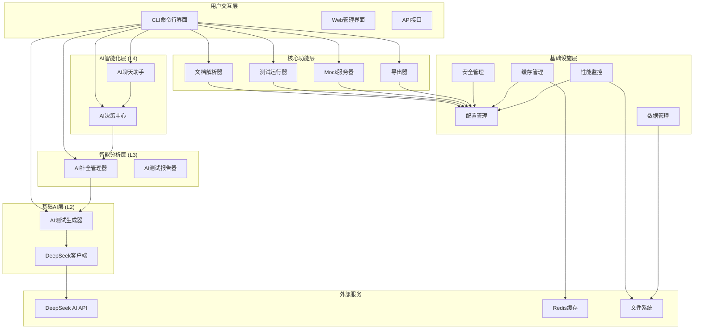
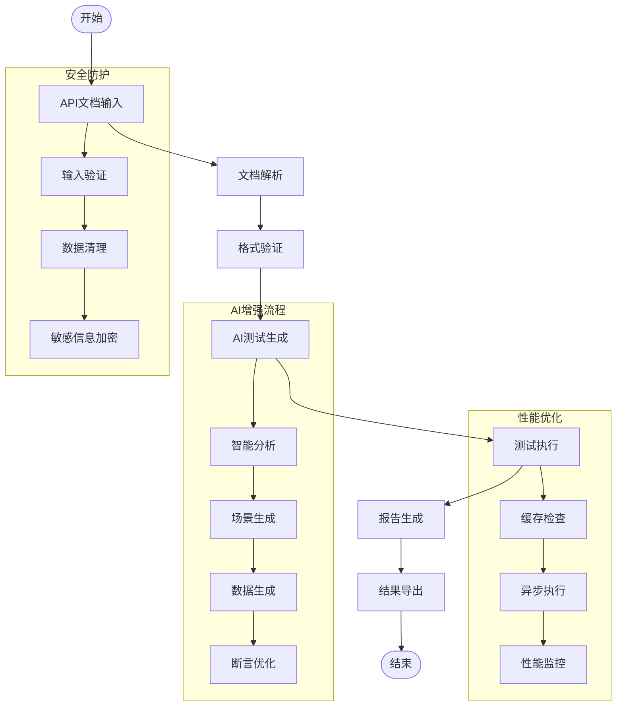
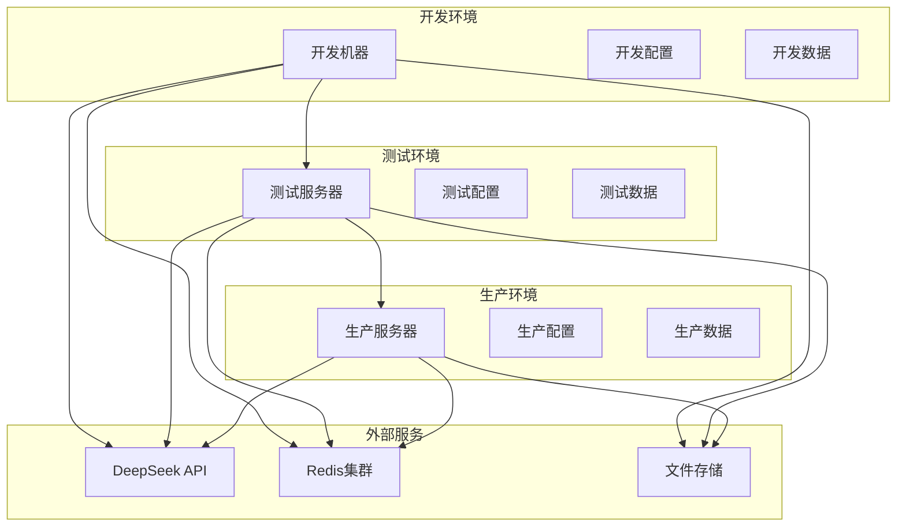
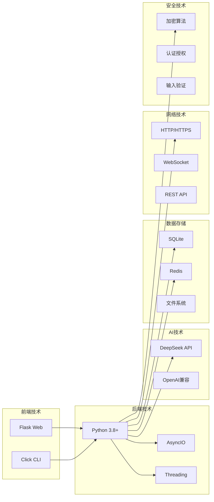

# 接口自动化测试框架 - 项目架构图

## 整体架构图

## 模块依赖关系图

```mermaid
graph LR
    subgraph "src/"
        subgraph "cli/"
            main[main.py]
            advanced[advanced_generator.py]
            ai_cmd[ai_*.py]
        end
        
        subgraph "ai/"
            client[deepseek_client.py]
            generator[ai_test_generator.py]
            reporter[ai_test_reporter.py]
            completion[ai_completion_manager.py]
            decision[ai_decision_center.py]
            chat[ai_chat_assistant.py]
        end
        
        subgraph "core/"
            base[base_test.py]
            request[request_handler.py]
            async_request[async_request_handler.py]
            executor[test_executor.py]
        end
        
        subgraph "utils/"
            config[config_loader.py]
            security[security_manager.py]
            cache[cache_manager.py]
            monitor[performance_monitor.py]
            data[data_manager.py]
            faker[data_faker.py]
            validator[validator.py]
        end
        
        subgraph "parsers/"
            openapi[openapi_parser.py]
            postman[postman_parser.py]
            custom[custom_parser.py]
        end
        
        subgraph "runners/"
            runner[test_runner.py]
            intelligent[intelligent_test_runner.py]
            report[report_generator.py]
        end
        
        subgraph "mock/"
            server[mock_server.py]
            data[mock_data.py]
        end
        
        subgraph "exporters/"
            exporter[test_case_exporter.py]
        end
        
        subgraph "auth/"
            auth[auth_manager.py]
        end
        
        subgraph "workflow/"
            dependency[dependency_manager.py]
        end
    end
    
    main --> client
    main --> generator
    main --> config
    main --> security
    
    client --> security
    generator --> client
    reporter --> client
    completion --> generator
    decision --> client
    chat --> decision
    
    base --> request
    base --> config
    request --> security
    async_request --> security
    executor --> base
    
    config --> security
    cache --> security
    monitor --> security
    data --> security
    
    openapi --> config
    postman --> config
    custom --> config
    
    runner --> base
    intelligent --> decision
    report --> runner
    
    server --> config
    data --> config
    
    exporter --> config
    
    auth --> security
    
    dependency --> config
```

## 数据流图

## 部署架构图

## 技术栈图

## 优化后的架构特点

### 🏗️ 四层智能化架构
- **L1 基础AI功能**: DeepSeek客户端、测试生成器、报告生成器
- **L2 智能分析**: AI补全管理器、统一协调
- **L3 智能决策**: AI决策中心、自适应推荐
- **L4 智能交互**: AI聊天助手、自然语言交互

### 🔒 安全增强
- 敏感信息加密存储
- 输入验证和数据清理
- SQL注入和XSS防护
- 安全配置管理

### ⚡ 性能优化
- 异步HTTP请求处理
- 内存和Redis缓存
- 并发测试执行
- 性能监控和指标收集

### 📊 监控体系
- 实时性能监控
- 系统资源监控
- 错误率统计
- 性能报告生成

### 🛠️ 可扩展性
- 模块化设计
- 插件化架构
- 配置驱动
- 多环境支持
