# 接口自动化测试框架 - 项目流程图

## 0. 项目架构图

### 0.1 系统整体架构

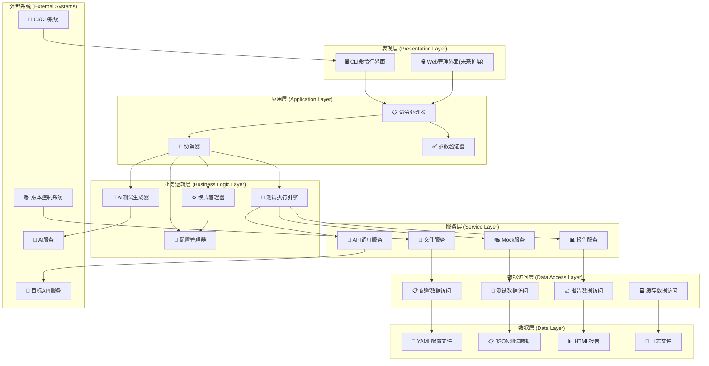

### 0.2 核心模块架构

```mermaid
graph TB
    subgraph "核心框架 (Core Framework)"
        BASE["🏗️ BaseTest\n基础测试类"]
        RUNNER["🏃 TestRunner\n测试运行器"]
        ENGINE["⚙️ TestEngine\n测试引擎"]
    end
    
    subgraph "解析器模块 (Parser Module)"
        OPENAPI["📖 OpenAPIParser\nOpenAPI解析器"]
        POSTMAN["📮 PostmanParser\nPostman解析器"]
        CUSTOM["🔧 CustomParser\n自定义解析器"]
    end
    
    subgraph "AI模块 (AI Module)"
        AI_GEN["🤖 AITestGenerator\nAI测试生成器"]
        AI_ANALYZER["🔍 AIAnalyzer\nAI分析器"]
        AI_ENHANCER["⚡ AIEnhancer\nAI增强器"]
    end
    
    subgraph "Mock模块 (Mock Module)"
        MOCK_SERVER["🎭 MockServer\nMock服务器"]
        MOCK_DATA["📊 MockDataGenerator\nMock数据生成器"]
        MOCK_ROUTER["🛣️ MockRouter\nMock路由器"]
    end
    
    subgraph "配置模块 (Configuration Module)"
        CONFIG_LOADER["📥 ConfigLoader\n配置加载器"]
        ENV_MGR["🌍 EnvironmentManager\n环境管理器"]
        MODE_SWITCHER["🔄 ModeSwitcher\n模式切换器"]
    end
    
    subgraph "报告模块 (Report Module)"
        HTML_GEN["📄 HTMLReportGenerator\nHTML报告生成器"]
        JSON_GEN["📋 JSONReportGenerator\nJSON报告生成器"]
        METRICS["📊 MetricsCollector\n指标收集器"]
    end
    
    subgraph "工具模块 (Utility Module)"
        HTTP_CLIENT["🌐 HTTPClient\nHTTP客户端"]
        VALIDATOR["✅ ResponseValidator\n响应验证器"]
        LOGGER["📝 Logger\n日志记录器"]
    end
    
    %% 模块间关系
    ENGINE --> BASE
    RUNNER --> ENGINE
    ENGINE --> OPENAPI
    ENGINE --> POSTMAN
    ENGINE --> CUSTOM
    
    ENGINE --> AI_GEN
    AI_GEN --> AI_ANALYZER
    AI_GEN --> AI_ENHANCER
    
    ENGINE --> MOCK_SERVER
    MOCK_SERVER --> MOCK_DATA
    MOCK_SERVER --> MOCK_ROUTER
    
    ENGINE --> CONFIG_LOADER
    CONFIG_LOADER --> ENV_MGR
    CONFIG_LOADER --> MODE_SWITCHER
    
    ENGINE --> HTML_GEN
    ENGINE --> JSON_GEN
    ENGINE --> METRICS
    
    BASE --> HTTP_CLIENT
    BASE --> VALIDATOR
    BASE --> LOGGER
```

### 0.3 数据流架构

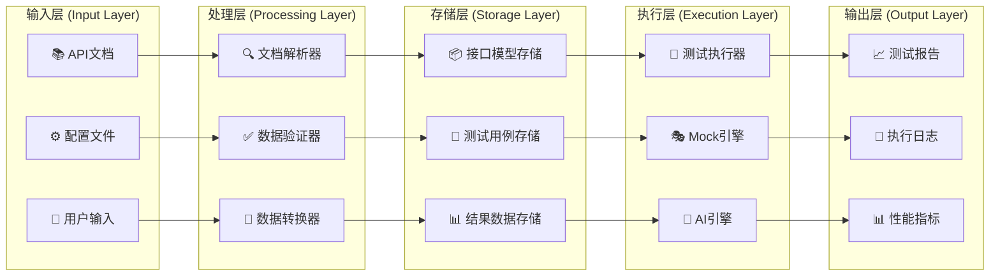

### 0.4 部署架构

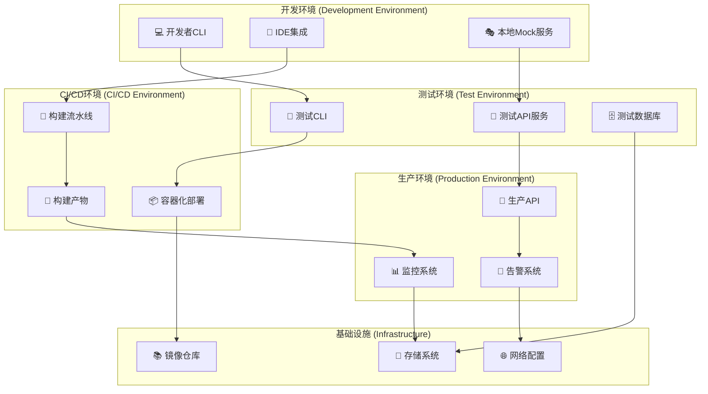

## 1. 整体架构流程图

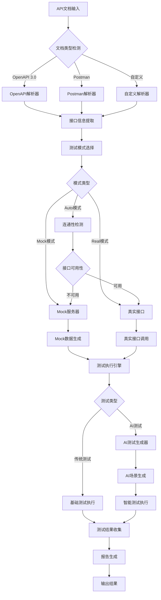

## 2. 测试模式选择流程

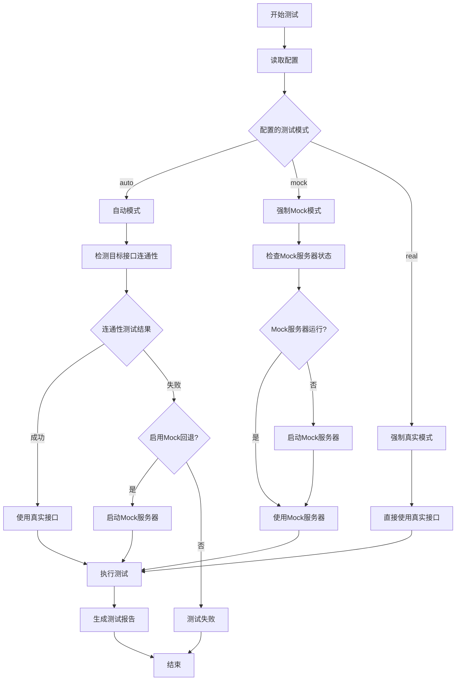

## 3. AI测试生成流程

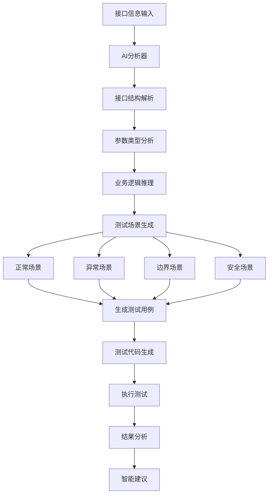

## 4. 详细功能模块流程

### 4.1 配置管理流程

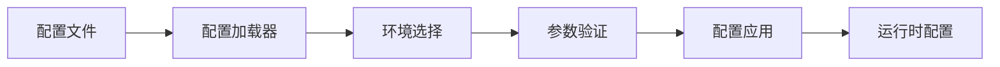

### 4.2 Mock服务器管理流程

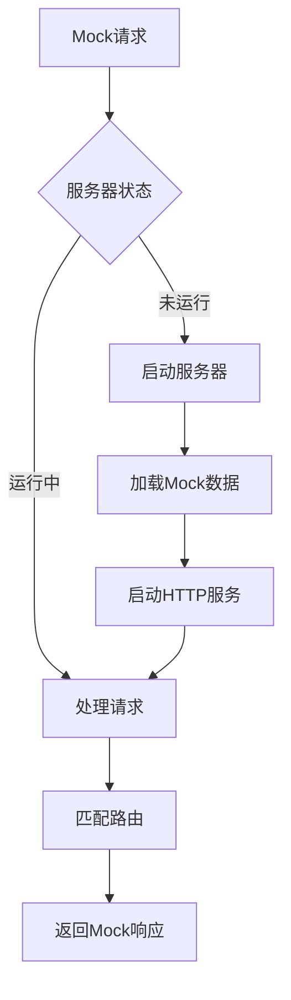

### 4.3 测试执行流程

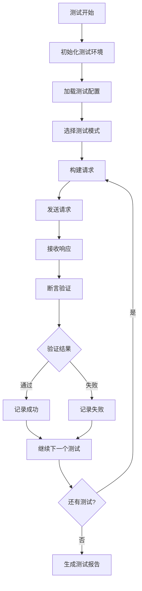

## 5. CLI命令流程图

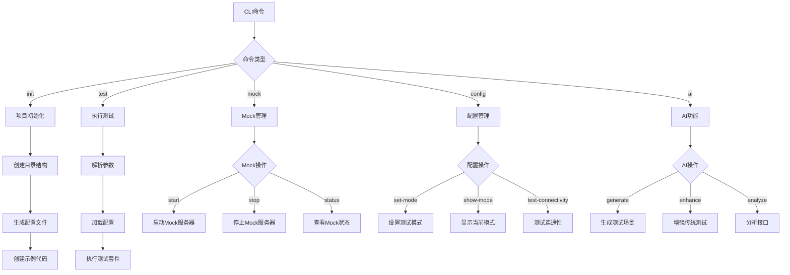

## 6. 数据流向图

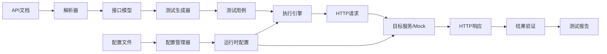

## 7. 错误处理流程

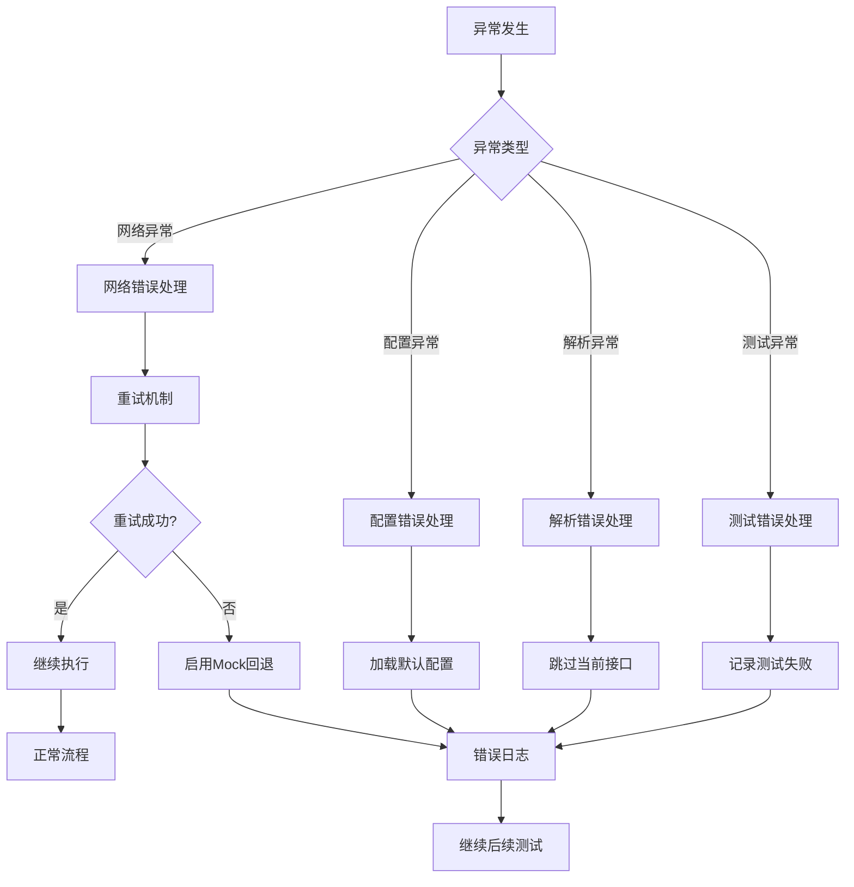

## 8. 测试报告生成流程

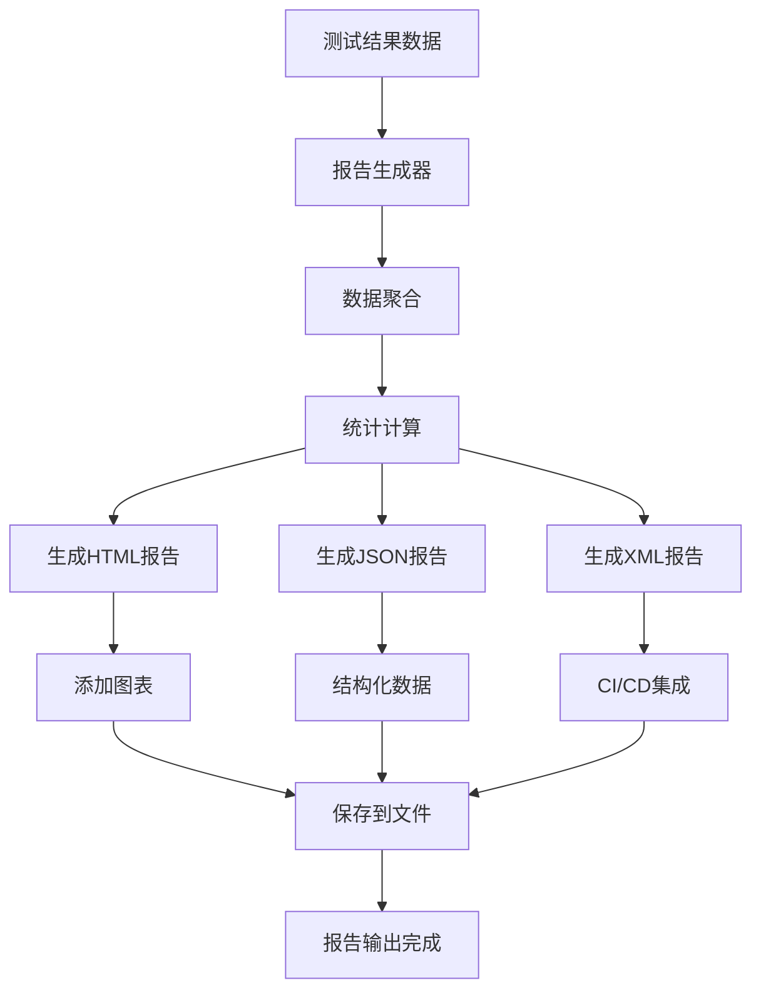

## 9. 系统交互图

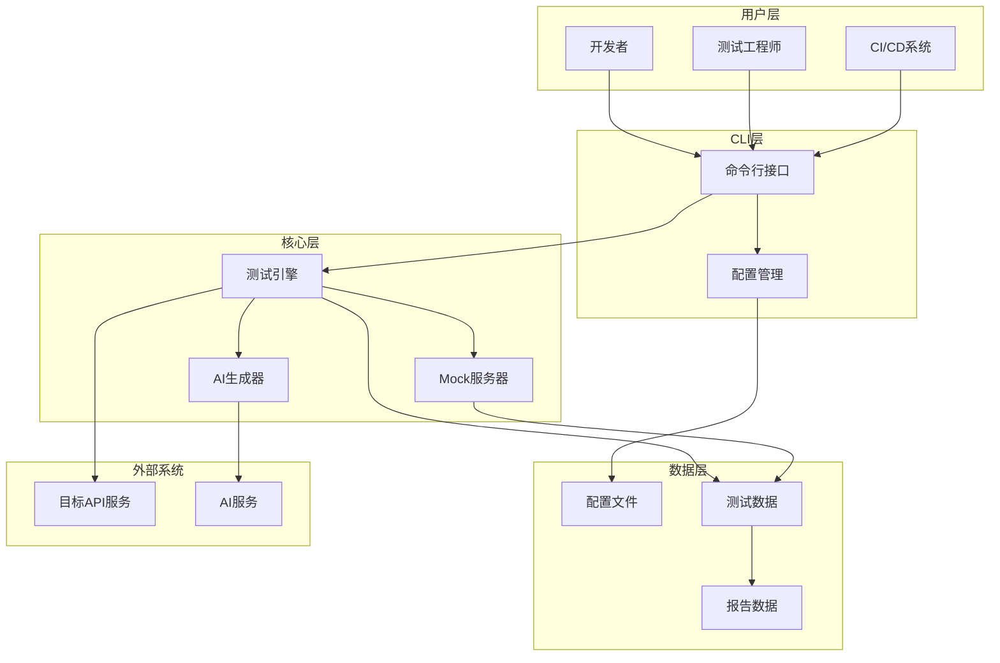

## 10. 使用场景流程图

### 10.1 快速开始场景

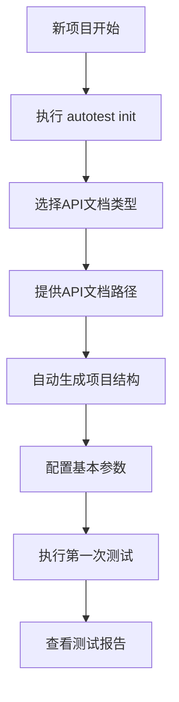

### 10.2 CI/CD集成场景

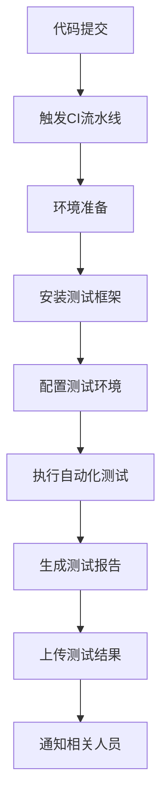

### 10.3 AI增强测试场景

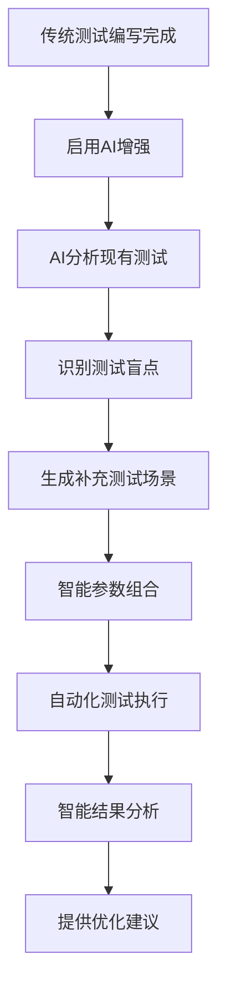

## 总结

这个流程图展示了接口自动化测试框架的完整工作流程，包括：

1. **核心架构**：从API文档输入到测试结果输出的完整流程
2. **模式选择**：智能的测试模式切换机制
3. **AI集成**：AI驱动的测试生成和增强流程
4. **功能模块**：各个核心模块的详细工作流程
5. **错误处理**：完善的异常处理和回退机制
6. **系统交互**：用户、系统和外部服务的交互关系

该框架通过模块化设计和智能化功能，为接口测试提供了全面、高效、易用的解决方案。